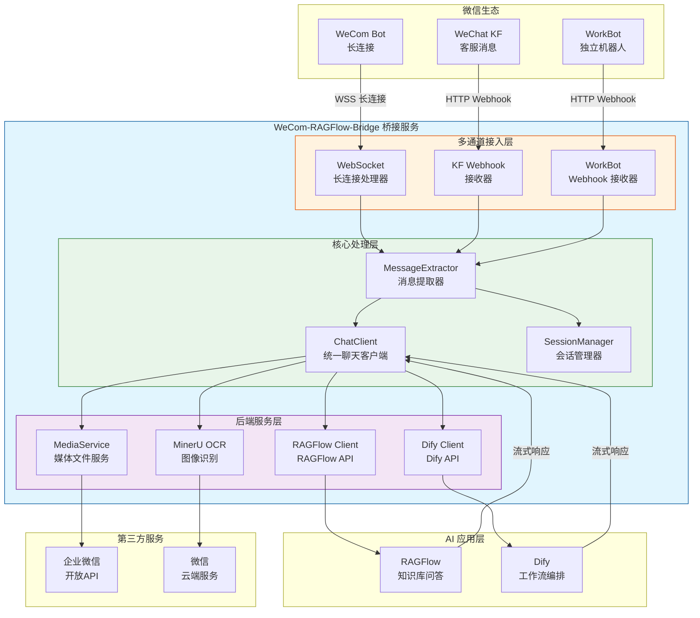
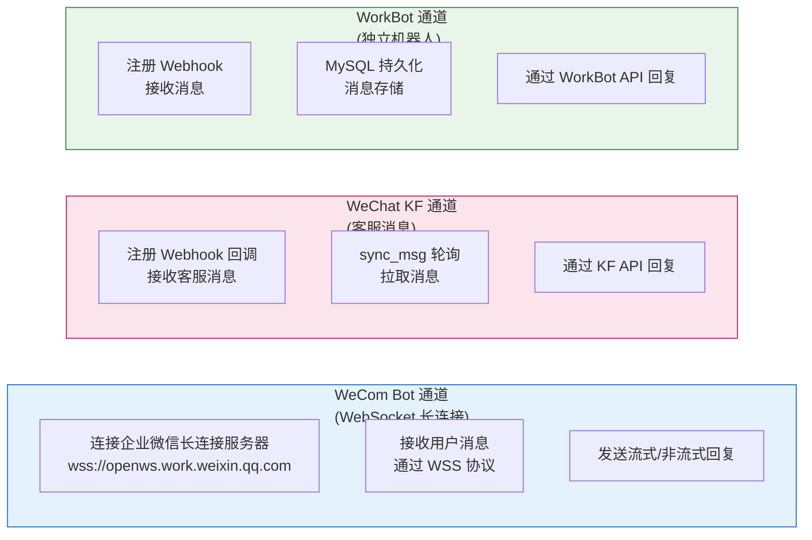
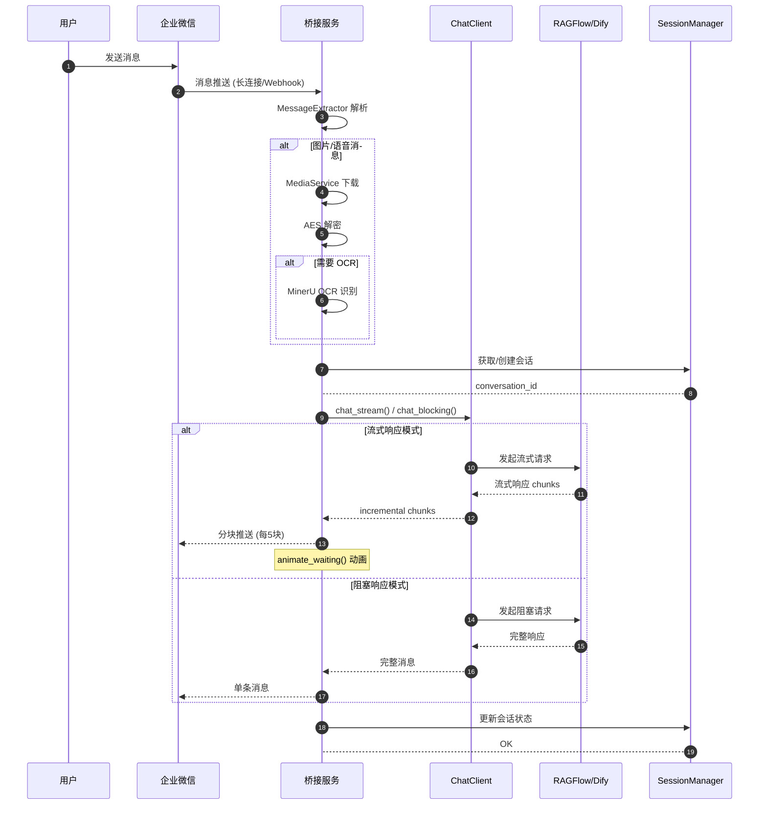
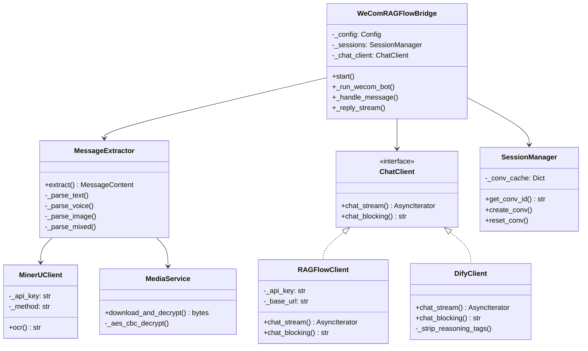
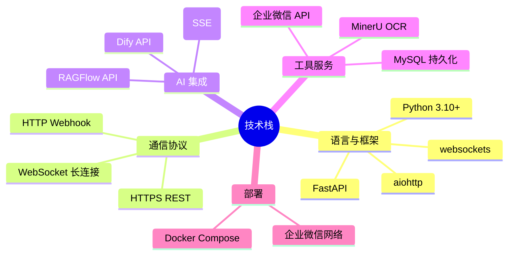
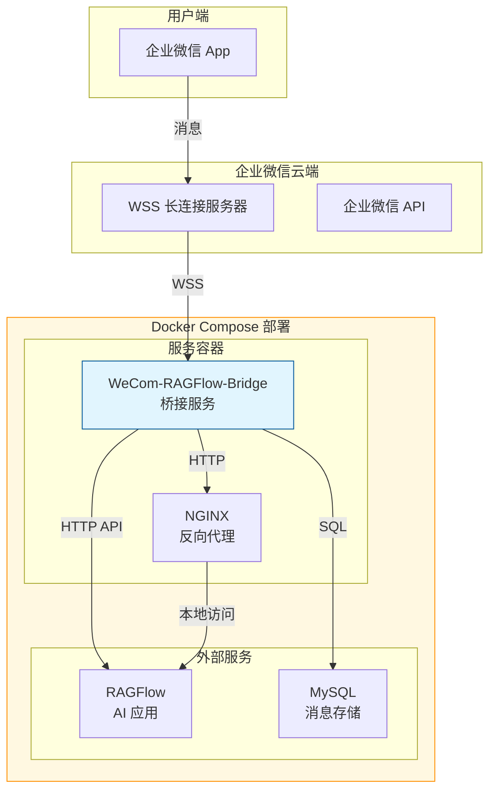

# WeCom-RAGFlow-Bridge 项目架构图

## 一、项目概述

**WeCom-RAGFlow-Bridge** 是一款企业微信智能机器人桥接服务，通过 WebSocket 长连接方式接收企业微信消息，将用户请求转发至后端 AI 应用（RAGFlow 或 Dify），并将 AI 流式响应实时推送回用户。

> **核心特点**：无需公网 IP，通过长连接模式实现消息收发，大幅降低部署复杂度。

---

## 二、整体架构图



---

## 三、三通道架构详解



### 通道对比

| 通道 | 协议 | 消息获取方式 | 消息发送方式 | 特点 |
|------|------|-------------|-------------|------|
| **WeCom Bot** | WebSocket | 长连接推送 | 长连接推送 | 实时性高，无需公网 IP |
| **WeChat KF** | HTTP Webhook | 回调 + 轮询 | KF API | 支持客服功能 |
| **WorkBot** | HTTP Webhook | 回调 | WorkBot API | 支持 MySQL 持久化 |

---

## 四、消息处理流程



---

## 五、核心组件架构



---

## 六、技术栈



---

## 七、部署架构



---

## 八、目录结构

```
wecom-ragflow-bridge/
├── config/
│   ├── .env.example          # 环境变量模板
│   └── media/                 # 媒体文件存储
├── src/
│   ├── main.py                # 入口，WeComRAGFlowBridge 主类
│   ├── config.py              # 配置加载
│   ├── protocol.py            # 协议定义，MessageBuilder
│   ├── session.py             # 会话管理
│   ├── scheduler.py           # 定时任务
│   │
│   ├── chat_client.py        # 统一聊天客户端接口
│   ├── ragflow_client.py     # RAGFlow 实现
│   ├── dify_client.py        # Dify 实现
│   │
│   ├── message_extractor.py  # 消息解析
│   ├── media_service.py      # 媒体下载与 AES 解密
│   ├── mineru_client.py       # MinerU OCR
│   ├── wecom_api.py          # 企业微信 API
│   │
│   ├── wechat_kf.py          # 微信客服通道
│   ├── workbot.py            # WorkBot 通道
│   ├── workbot_storage.py    # WorkBot MySQL 存储
│   ├── webhook_server.py     # 共享 Webhook 服务器
│   ├── service_factory.py    # 服务工厂
│   └── animation.py           # 流式响应动画
│
├── docker-compose.yml
├── requirements.txt
├── docs/
│   └── architecture.md       # 本文档
└── README.md
```

---

## 九、环境变量配置

| 变量 | 说明 | 必需 | 默认值 |
|------|------|------|--------|
| `WECOM_BOT_ENABLED` | 启用 WeCom Bot 通道 | 否 | `true` |
| `WECOM_BOT_ID` | Bot ID | 是 | - |
| `WECOM_SECRET` | Bot Secret | 是 | - |
| `WECOM_KF_ENABLED` | 启用客服通道 | 否 | `false` |
| `CHAT_PROVIDER` | 聊天后端 | 是 | `ragflow` |
| `RAGFLOW_API_KEY` | RAGFlow API Key | 是 | - |
| `RAGFLOW_API_BASE` | RAGFlow API 地址 | 是 | - |
| `DIFY_API_KEY` | Dify API Key | 是 (Dify模式) | - |
| `WECOM_CORP_ID` | 企业 ID (OCR用) | 否 | - |
| `MEDIA_DIR` | 媒体文件存储目录 | 否 | `./config/media` |

---

## 版本信息

- **文档版本**: v1.0
- **更新日期**: 2026-06-25
- **项目版本**: 参考 `git log` 最近提交
